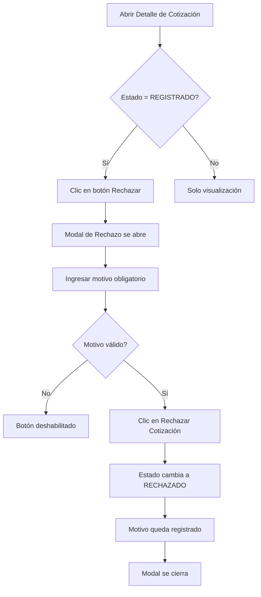
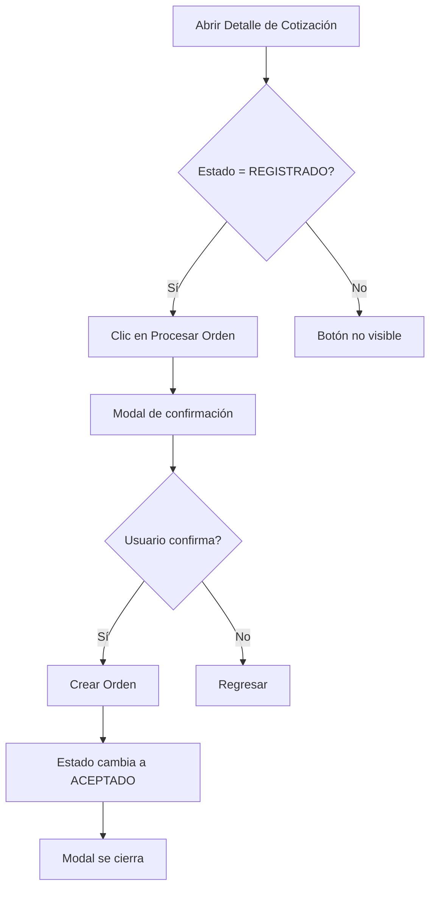

# 📝 Actualización de Estados en Cotizaciones

## 🎯 Resumen de Cambios

Se han implementado mejoras significativas en el sistema de cotizaciones:

### 1. **Cambios de Nomenclatura de Estados**
- ✅ `TERMINADO` → `ACEPTADO`
- ❌ `CANCELADO` → `RECHAZADO`

### 2. **Nueva Funcionalidad: Motivo de Rechazo**
- Se agregó un campo obligatorio `rejection_reason` (TEXT) en la tabla `quotations`
- Al rechazar una cotización, se debe especificar el motivo
- El motivo queda registrado en el historial de la cotización

---

## 🗄️ Migración de Base de Datos

### Paso 1: Ejecutar Script SQL en Supabase

1. Abre el **SQL Editor** en tu dashboard de Supabase
2. Copia y pega el contenido del archivo `COTIZACIONES_STATUS_UPDATE.sql`
3. Ejecuta el script

El script realizará automáticamente:
- ✅ Agregar columna `rejection_reason`
- ✅ Actualizar registros existentes: `TERMINADO` → `ACEPTADO`, `CANCELADO` → `RECHAZADO`
- ✅ Actualizar constraint CHECK con los nuevos valores
- ✅ Crear índice para búsquedas eficientes

### Paso 2: Verificación

Ejecuta esta consulta para verificar que la migración fue exitosa:

```sql
-- Verificar distribución de estados
SELECT status, COUNT(*) as cantidad 
FROM quotations 
GROUP BY status;

-- Verificar estructura de tabla
SELECT column_name, data_type, is_nullable
FROM information_schema.columns 
WHERE table_name = 'quotations' 
ORDER BY ordinal_position;
```

---

## 🎨 Cambios en la UI

### Modal de Rechazo (`RejectQuotationModal.jsx`)
Un nuevo modal especializado que incluye:
- 📝 **Textarea obligatorio** para el motivo del rechazo
- ✅ **Validación** de entrada (no permite envío si está vacío)
- 🎯 **Estados de loading** durante el proceso
- 🎨 **Diseño consistente** con el sistema de modales mejorados

### Modal de Detalle de Cotización (`QuotationDetailModal.jsx`)
Mejoras implementadas:
- 🔴 **Botón "Rechazar"** - Abre el modal de rechazo con input de motivo
- 👁️ **Visualización del motivo** - Si la cotización está rechazada, muestra el motivo en un badge
- ✅ **Badges actualizados** - Muestran ACEPTADO y RECHAZADO con colores apropiados

### Página Principal de Cotizaciones (`Cotizaciones.jsx`)
- 🔍 **Filtros actualizados** - Opciones de filtro con Aceptado/Rechazado
- 🎨 **Badges de estado** - Colores actualizados para los nuevos estados
- ⚠️ **Modal de confirmación** mejorado para rechazo rápido desde tabla

---

## 🔧 Cambios en el Servicio

### `QuotationService.js`

#### Nuevo método: `rejectQuotation`
```javascript
rejectQuotation: async (id, rejectionReason) => {
    const { data, error } = await supabase
        .from('quotations')
        .update({ 
            status: 'RECHAZADO',
            rejection_reason: rejectionReason || null
        })
        .eq('id', id)
        .select()
        .single();
    if (error) throw error;
    return transformQuotation(data);
}
```

#### Método actualizado: `processQuotationToOrder`
- Ahora cambia el estado a `ACEPTADO` en lugar de `TERMINADO`

#### Transformación actualizada
- Se agregó el campo `rejectionReason` en la transformación de datos

---

## 📋 Flujo de Usuario

### Rechazar una Cotización



### Procesar una Cotización



---

## 🎯 Estados Posibles

| Estado | Descripción | Color | Puede Editar | Puede Rechazar | Puede Procesar |
|--------|-------------|-------|--------------|----------------|----------------|
| **REGISTRADO** | Cotización recién creada | 🔵 Azul | ✅ | ✅ | ✅ |
| **ACEPTADO** | Procesada exitosamente como orden | 🟢 Verde | ❌ | ❌ | ❌ |
| **RECHAZADO** | Rechazada con motivo registrado | 🔴 Rojo | ❌ | ❌ | ❌ |

---

## ⚠️ Consideraciones Importantes

### Rechazo Rápido desde Tabla
En la vista de tabla principal, existe un botón de rechazo rápido (ícono de papelera) que:
- ⚠️ Rechaza la cotización con el motivo genérico: "Rechazado desde la tabla"
- 💡 **Recomendación**: Considerar remover esta funcionalidad o mejorarla para requerir un motivo específico

### Compatibilidad con Datos Existentes
- ✅ El script SQL actualiza automáticamente los registros existentes
- ✅ Los estados antiguos se migran a los nuevos nombres
- ✅ El campo `rejection_reason` puede ser NULL para cotizaciones existentes

### Validación
- ✅ La constraint CHECK solo permite: `REGISTRADO`, `ACEPTADO`, `RECHAZADO`
- ✅ El frontend valida que se ingrese un motivo antes de rechazar
- ✅ El servicio acepta `null` para `rejection_reason` pero el modal no lo permite

---

## 🚀 Próximos Pasos

1. ✅ Ejecutar el script de migración en Supabase
2. ✅ Verificar que los cambios se aplicaron correctamente
3. ✅ Probar el flujo completo de rechazo con motivo
4. ✅ Probar el flujo de procesamiento (ACEPTADO)
5. ✅ Verificar que los filtros funcionan con los nuevos estados
6. 💡 Considerar agregar un historial de cambios de estado (opcional)
7. 💡 Considerar reportes/métricas por motivos de rechazo (opcional)

---

## 📞 Soporte

Si encuentras algún problema durante la migración:
1. Verifica que el script SQL se ejecutó completamente sin errores
2. Revisa la consola del navegador para errores de JavaScript
3. Verifica que los estados en la base de datos sean correctos
4. Limpia el caché del navegador si ves datos antiguos

---

**Fecha de actualización**: 2026-02-12
**Versión**: 1.0
